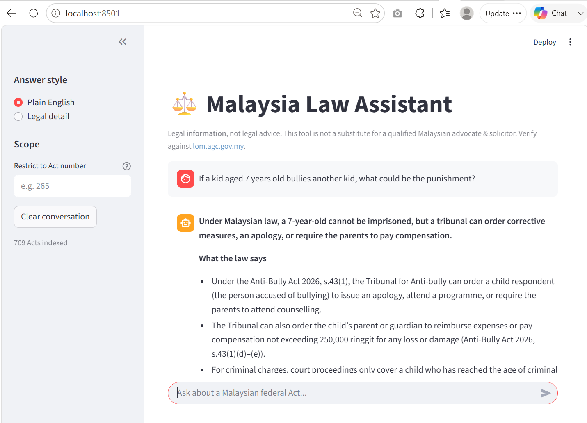
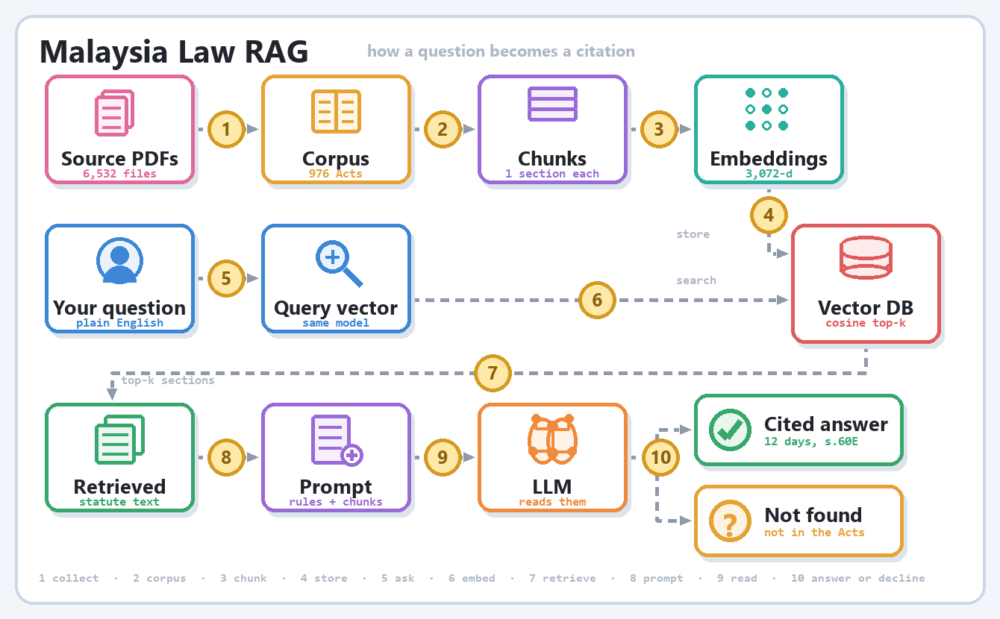

# Malaysia Law Assistant

A retrieval-augmented chatbot over Malaysian federal legislation. It answers
questions by reading the statute book — citing the Act and section every time,
and declining when the answer isn't in the corpus.





## Why retrieval, not a bigger prompt

Ask any general model about Malaysian law and it produces fluent, confident,
wrong answers — invented section numbers and plausible-looking case citations.
The failure isn't ignorance, it's fluency without a source.

So the model is never asked to *recall* Malaysian law. It is handed the
relevant statute text at question time and told to answer only from that. The
model is a commodity; the corpus is the work. Roughly 80% of the effort here
went into turning 6,532 government PDFs into clean, section-addressable text.

## Status

| | |
|---|---|
| Acts parsed | 976 |
| Acts indexed | 709 |
| Sections indexed | 32,387 |
| Eval suite | 22/22 passing |
| Indexing cost | ~$1.40, one time |

## Setup

```bash
pip install -r requirements.txt
setx GEMINI_API_KEY "your-key-here"     # then open a NEW terminal
```

Get a key at [aistudio.google.com](https://aistudio.google.com). Use the paid
tier before any real user touches this — on the free tier prompts may be used
to improve Google's products, and this app receives people's actual legal
problems.

## Pipeline

```bash
# 1. Download the Acts from the AGC portal (several GB, takes hours)
python download_lom.py --all

# 2. Extract, clean, and split every Act into its sections
python build_corpus.py --test        # 20 Acts, prints samples
python build_corpus.py               # the full run

# 3. Upload to a Gemini File Search store
python ingest.py --acts 265,177      # start narrow and verify by hand
python ingest.py --workers 4         # everything

# 4. Run it
streamlit run app.py

# 5. Check nothing regressed
python eval.py --save baseline.json
```

## Files

| File | Does what |
|---|---|
| `download_lom.py` | Polite, resumable downloader for lom.agc.gov.my |
| `build_corpus.py` | PDF → text → one record per statute section |
| `ingest.py` | Groups sections by Act, uploads to the vector store |
| `app.py` | Streamlit chat UI, and the system prompt that enforces grounding |
| `eval.py` | 22-case regression suite; exits non-zero on failure |
| `eval_questions.json` | The cases: citations, refusals, cross-Act traps |
| `make_gif_*.py` | Diagram generators |

## How grounding is enforced

`SYSTEM_PROMPT` in `app.py` is the actual product surface. It forbids
answering from memory, mandates a section citation per claim, bans advice
phrasing, and requires the assistant to declare when a question needs case law
or state enactments it doesn't hold.

Worth being precise about where refusal happens: **not in the vector
database**. Nearest-neighbour search always returns its top-k at any score and
never signals "nothing here" — there is no similarity threshold in the API.
The refusal is a judgment made by the model reading the retrieved text. Nothing
in the code enforces it, which is exactly why `eval.py` exists: 6 of its 22
cases ask questions whose answers are outside the corpus and check that the
assistant declines instead of confabulating from a plausible neighbour.

## Known limits

- **No case law.** Malaysian judgments are paywalled (CLJ, LexisNexis).
- **No subsidiary legislation, state enactments, or Syariah law.** Federal
  principal Acts only.
- **No Federal Constitution.** The Reprint 2020 interleaves ~130 editorial
  NOTES blocks with the operative text and cannot be split reliably by pattern.
- **No Contracts Act 1950.** AGC publishes it only as a scan with no text
  layer; recovering it needs OCR.
- **Acts needing OCR are silently absent** — check `corpus/skipped.csv` before
  assuming coverage of any particular statute.
- **Consolidated snapshots, not live law.** Amendments after each reprint date
  are not reflected. Verify at [lom.agc.gov.my](https://lom.agc.gov.my).

## Legal positioning

This is legal **information**, not legal advice. The Legal Profession Act 1976
reserves the practice of law to admitted advocates & solicitors, so the system
prompt bans advice phrasing and every answer carries a disclaimer. If you plan
to let anyone else use this, talk to a Malaysian lawyer first. PDPA 2010 also
applies once user queries are stored.

## Source data

All documents are public legal texts published by the Attorney General's
Chambers of Malaysia. The PDFs themselves are not committed here — run
`download_lom.py` to fetch them.
